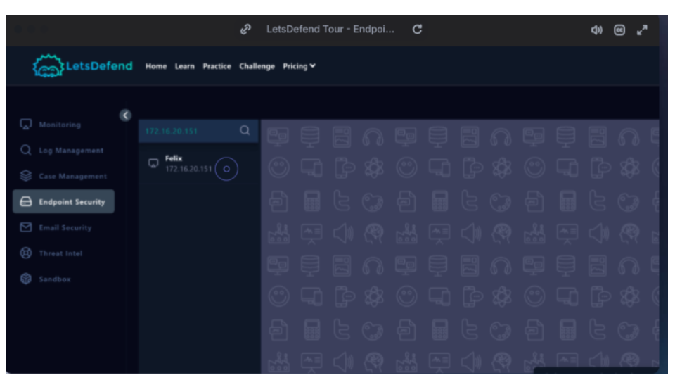
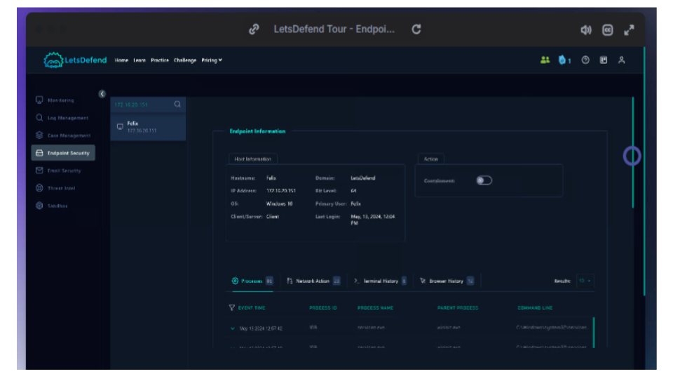
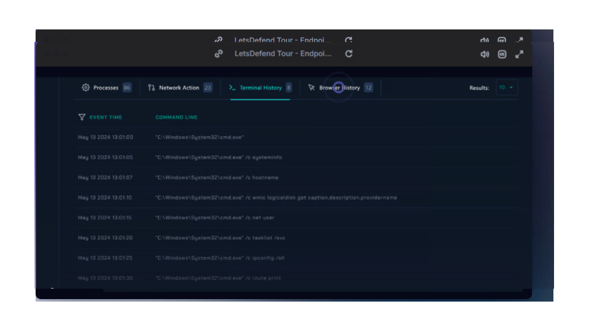
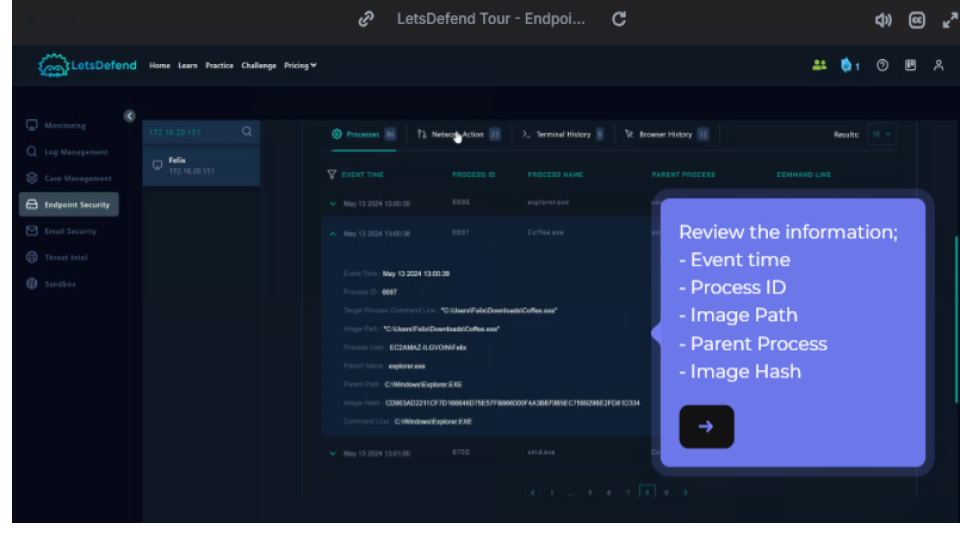
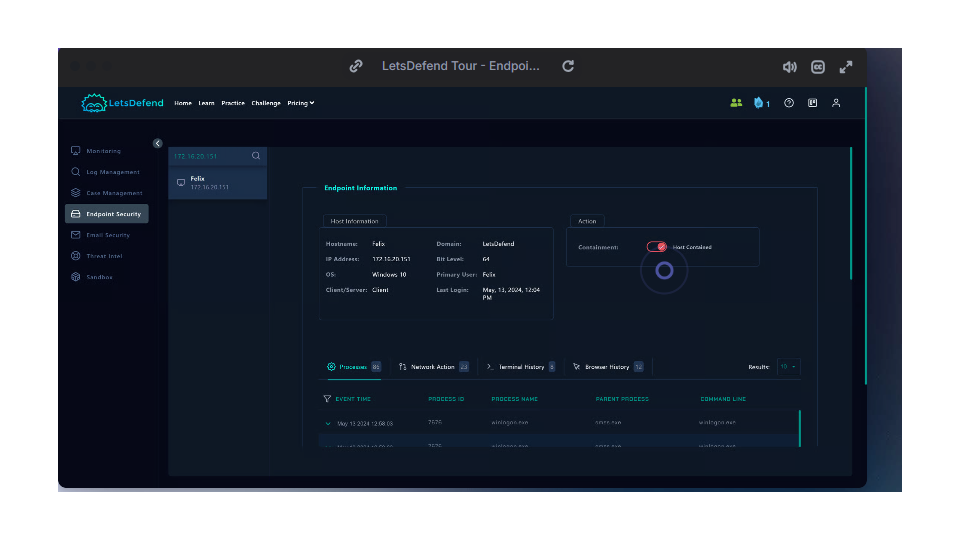

## 🚨EDR Investigation: Suspicious Command Execution

## 🧠 Overview

This project documents an endpoint investigation performed using LetsDefend EDR simulation environment.

The goal was to analyze suspicious command-line activity and determine if it represents malicious behavior.

## 🚨 Incident Summary
Alert Type: Suspicious Command Execution
Affected System: Windows Endpoint
Severity: Medium
Technique: System Enumeration

## 🔍 Investigation
1. Terminal Activity Analysis

The following commands were executed:

cmd.exe /c systeminfo
cmd.exe /c hostname
cmd.exe /c wmic logicaldisk get caption,description,providername
cmd.exe /c net user
cmd.exe /c tasklist /svc
cmd.exe /c ipconfig /all
cmd.exe /c route print

2. Why This is Suspicious

These commands indicate:

System information gathering
Network reconnaissance
User enumeration

## 👉 This behavior aligns with early-stage attacker activity.

3. Process Behavior
Multiple commands executed via cmd.exe
Indicates scripted or automated activity
Possible attacker using command shell for discovery

## 🧯 Response Actions
Identified activity as suspicious
Flagged as potential compromise
Recommended endpoint isolation
Suggested further investigation of parent process

## 🔐 Detection Logic
IF cmd.exe executes multiple enumeration commands in short time → ALERT

📚 Lessons Learned
Attackers often use built-in Windows tools (Living off the Land)
Command-line logging is critical for detection
EDR visibility helps identify early attack stages

### 📊 Evidence 

<h1 align="center">Endpoint monitoring dashboard showing connected hosts and EDR visibility</h1>

    

<h1 align="center">Endpoint investigation panel displaying host details and active containment status</h1>

    

<h1 align="center">Terminal history investigation revealing executed system commands on the endpoint.</h1>

    

<h1 align="center">Process analysis review showing suspicious process execution details and hashes</h1>

    

<h1 align="center">Endpoint containment action isolating the affected device to prevent further compromise</h1>

    

All screenshots are here:

🔗 [Google Slides ](https://docs.google.com/presentation/d/1LtvSIGcDIstJYMbNJRFoO9rQfWfAeFg_l_9pfWqmNEI/edit?usp=sharing)
